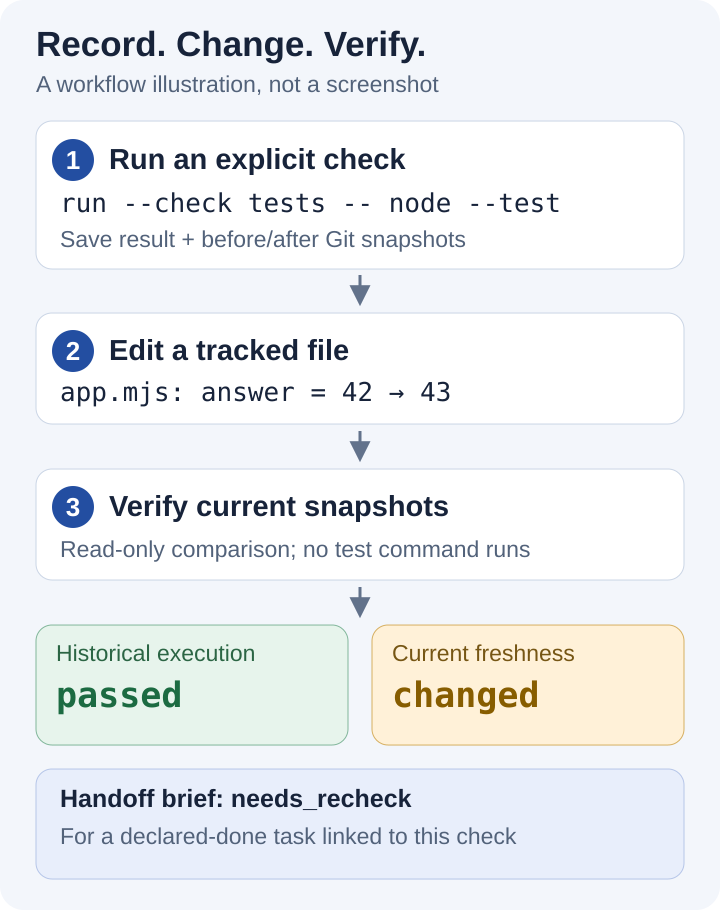

# RepoProof

### Local Git check receipts for coding handoffs

**Record command results against Git file snapshots, then see when code changes make that evidence stale. Historical execution results stay separate from the current file state.**

English | [中文](README_ZH.md)

[Quick Start](#quick-start) · [Workflow](#historical-results-and-current-file-state) · [Commands](#commands) · [Documentation](#documentation)



*Workflow illustration based on the included demo, not a runtime screenshot. Verification compares snapshots without rerunning the recorded command.*


## Features

- Record explicit commands with their results and before/after Git file snapshots.
- Detect tracked changes at the same Git HEAD; opt in to include untracked files.
- Create Chinese, English, or JSON briefs that distinguish evidence from self-reported completion.
- Keep receipts local, with bounded previews and best-effort credential redaction.

## Quick Start


Requires **Node.js >=24.12.0** and **Git >=2.30**. There are no runtime dependencies, accounts, model API keys, or background services.

Clone and build the source; no dependency installation is needed:

```sh
git clone https://github.com/cloudwallker/repoproof.git
cd repoproof
npm run build
node bin/repoproof.mjs --help
```

### Optional local package for offline use

First create your own tarball in the source directory, then install it into a chosen directory:

```sh
npm pack
npm install --prefix ./tools --offline --ignore-scripts ./repoproof-0.1.0.tgz
node ./tools/node_modules/repoproof/bin/repoproof.mjs --help
```

Run `npm pack` in the RepoProof source directory; its `prepack` hook builds the JavaScript. Use the resulting file's actual path when installing elsewhere. The package needs no TypeScript compiler. This repository documents local packaging and does not promise a downloadable Release asset.

Inside an existing Git project, invoke the built CLI through its actual path:

```sh
node <RepoProof-directory>/bin/repoproof.mjs init --goal "Fix the login issue and hand off the work"
node <RepoProof-directory>/bin/repoproof.mjs run --check tests -- node --test
node <RepoProof-directory>/bin/repoproof.mjs verify --json
node <RepoProof-directory>/bin/repoproof.mjs brief --lang en
```

Replace `<RepoProof-directory>` with the directory you cloned, quoting paths that contain spaces. The shorter `repoproof` commands below apply when an installed package provides a shell shim; otherwise use this same Node invocation. Edit `.repoproof/task.json` to describe the goal, checks, tasks, and blockers. `init` never overwrites an existing manifest, initializes Git, or creates commits.

## Historical results and current file state

After a recorded test succeeds, edit a tracked source file and run `verify` again. The historical result stays `passed`; freshness becomes `changed` and includes the changed paths. A handoff brief now marks the associated declared-done task as needing a recheck.

The brief distinguishes work with recorded checks, self-reported completion, rechecks, remaining work, and blockers. A `done` declaration alone is never execution evidence.

## Commands

| Command | Purpose |
|---|---|
| `init --goal "goal"` | Create an editable task manifest |
| `run --check ID -- program args...` | Execute the explicitly supplied command and save a receipt |
| `verify [receipt.json]` | Read and compare evidence without executing its command |
| `brief` | Produce a handoff brief from the manifest and latest check records |

All commands support `--cwd`. `run`, `verify`, and `brief` support `--json`. `brief` accepts `--task`, `--lang zh|en`, and `--output <file-within-project>`; it refuses existing output files, Git internals, and linked directories.

Default timeout is **120000ms**; `--timeout` accepts integers from 1 to 86400000. Timeout, interruption, and spawn errors are recorded as `incomplete`; nonzero exits are `failed`. Each output stream retains up to 64KiB of redacted preview while excess output is drained.

If the system denies process-tree termination, RepoProof tries to stop the direct child through its process handle and reports the cleanup failure in the receipt preview. Restricted environments may require manual descendant cleanup.

Programs and arguments are executed directly with no implicit shell. For a pipeline, explicitly choose your own shell executable. On Windows, use `-- node --run test` to invoke a package.json script when a batch entry point cannot be executed directly.

## Snapshot scope

Tracked files are always included, including project configuration and lockfiles. Untracked files are excluded by default; the excluded count is visible. Include non-ignored files or directories explicitly:

```sh
repoproof run --check tests --include src/new-feature --include test/new-case.mjs -- node --test
```

`--include .` includes all non-ignored untracked files. Git ignore applies to untracked files. `.repoproof/` is always excluded, even if tracked. Add it to your project's `.gitignore`.

Symlink snapshots bind link text rather than target content. Paths escaping the repository through linked parents cannot be verified. Submodules are reported as unsupported in this version. Read failures, different before/after snapshots, and corrupt receipts never count as valid evidence.

## Exit codes and data

- **0:** successful operation with passing check records and matching snapshots.
- **1:** failed/incomplete/missing checks, changed snapshots, or unverifiable evidence.
- **2:** usage, format, or file-operation errors, including invalid receipts.

Help, version, and successful initialization return 0. A brief's exit code reflects check evidence rather than whether every task is declared done. Machine output goes to stdout; diagnostics go to stderr. Receipts are stored under `.repoproof/receipts/<UUID>.json`. See [usage and format notes](docs/usage.md).

## Limits and privacy

A past zero exit code does not establish adequate test coverage. Matching files do not establish matching environments, databases, remote services, or time-dependent conditions. Before/after snapshots cannot detect temporary modifications that are restored during execution.

SHA-256 detects changes and accidental corruption. A holder can recompute the hashes: receipts are unsigned and do not authenticate identity or establish independent provenance. Common credentials, private keys, URL authentication, email addresses, and personal home paths are redacted on a best-effort basis. Arbitrary secrets in natural language may escape detection; inspect exports before sharing. Snapshots store content hashes rather than source text; environment metadata records the Node version and platform rather than environment-variable values. Command arguments and captured output previews can still contain sensitive content. RepoProof itself does not transmit receipts.

## Development

```sh
npm test
npm run build
npm run demo
npm pack
node scripts/smoke-package.mjs ./repoproof-0.1.0.tgz
```

The repeatable demo runs a real test in an isolated temporary Git project, changes a source file, and exports before/after JSON and bilingual briefs to `artifacts/demo/`. Tests use disposable Git fixtures. The build strips TypeScript types using Node and checks JavaScript syntax; it does not provide semantic TypeScript checking.

CI is configured for Windows, macOS, and Linux with Node.js 24 and 26. [Platform support and validation](docs/VALIDATION.md) explains coverage and distinguishes local verification from configured CI jobs.

## Documentation

- [Usage and data formats](docs/usage.md)
- [Task manifest example](examples/task.json)
- [Platform support, test coverage, and evidence limits](docs/VALIDATION.md)
- [Changelog](CHANGELOG.md)

## Contributing and license

Run the tests before contributing and add behavior-focused regressions for changes. Licensed under the [MIT License](LICENSE).
